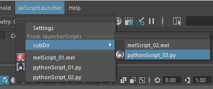
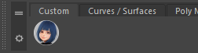
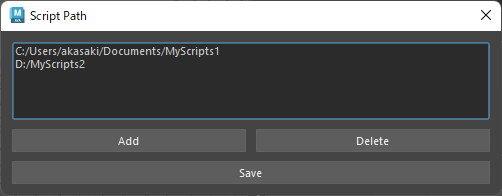

## Overview
Simple script launcher for Maya.  

The menu is updated each time it is displayed, there is no need to restart Maya.  


Can also be registered to shelf.  


Multiple script paths can be set, from the settings dialog.  


> **Note**  
> Requires Python 3.7 or later (Maya 2022 and above).  
> 
> * Maya 2027 (Python 3.13.9)
> * Maya 2026 (Python 3.11.9)
> * Maya 2025 (Python 3.11.4)
> * Maya 2024 (Python 3.10.8)
> * Maya 2023 (Python 3.9.7)  
> * Maya 2022 (Python 3.7.7)  

## Installation
1. Please do one of the following:
   * Copy the `akScriptLauncher` directory into the `C:\Users\<username>\Documents\maya\scripts`.
   * Add the parent directory of `akScriptLauncher` to PYTHONPATH environment variable.
2. Write the following command in `usersetup.py`.
```python
import akScriptLauncher
```
3. When you start Maya, `akScriptLauncher` is added to the menu bar.  
Select the scripts folder from Settings. The script folder path you set will be saved in `settings.json`.  

> **Note**  
> If you want to load/reload launcher while Maya is running, do the following  
> ```python
> import akScriptLauncher
> akScriptLauncher.initialize()
> ```

### Cusutomize menu name
The menu name is taken directly from the module name, so you can customize the menu by renaming the folder.  
For example, if you rename the `akScriptLauncher` folder to `MyScrips`, it will look like this:  
```python
import MyScrips
```


## Scripts
It recursively searches in the script folder and adds `*.py` and `*.mel` to the menu. Folders can be nested. If there is an icon image (`.ico` or `.png`) with the same name as the script file name, use it for the icon.  

```
ScriptFolder
│  melScript_01.ico
│  melScript_01.mel
│  pythonScript_01.ico
│  pythonScript_01.py
│  pythonScript_02.py
│
└─subDir
      melScript_02.mel
      pythonScript_03.png
      pythonScript_03.py
```

> **Warning**  
> * Python script must run by simply executing file.  
> * MEL script must have a executing function with the same name as the file name.  
