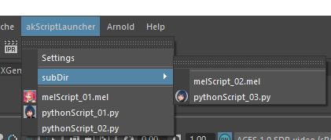

## Overview
Simple script launcher for Maya.  

The menu is updated each time it is displayed, there is no need to restart Maya.  


Can also be registered to shelf.  


Multiple script paths can be set, from the settings dialog.  


> Tested with :  
> * Maya 2023 (Python3.9.7)  
> * Maya 2022 (Python3.7.7)  
> * Maya 2020 (Python2.7.11)  

## Installation
1. Please do one of the following:
   * Copy the `akScriptLauncher` directory into the `C:\Users\<username>\Documents\maya\scripts`.
   * Add the parent directory of `akScriptLauncher` to PYTHONPATH environment variable.
2. Write the following command in `userSetup.py`.
```python
import akScriptLauncher
```
3. When you start Maya, `akScriptLauncher` is added to the menu bar.  
Select the scripts folder from Settings. The script folder path you set will be saved in `settings.json`.

> **Note**  
> You can rename `akScriptLauncher` folder to anything you like.

## Scripts
It recursively searches in the script folder and adds `*.py` and `*.mel` to the menu. Folders can be nested. If there is an icon image (`.ico` or `.png`) with the same name as the script file name, use it for the icon.  

```
ScriptFolder
│  melScript_01.ico
│  melScript_01.mel
│  pythonScript_01.ico
│  pythonScript_01.py
│  pythonScript_02.py
│
└─subDir
      melScript_02.mel
      pythonScript_03.png
      pythonScript_03.py
```

> **Warning**  
> * Python script must run by simply executing file.  
> * MEL script must have a executing function with the same name as the file name.  

